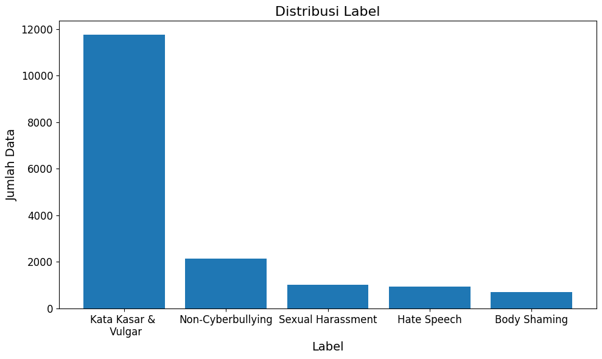
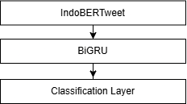

# Indonesian Twitter Cyberbullying Detection

A machine learning project for detecting and classifying cyberbullying in Indonesian social media text.

## Project Background and Overview

The rapid growth of social media usage has increased the amount of user-generated content in Indonesian. Among this content, cyberbullying can appear in various forms, including abusive language, sexual harassment, hate speech, and body shaming.

Identifying cyberbullying manually is difficult and time-consuming, especially when dealing with large volumes of short and informal social media texts. Indonesian social media text also presents additional challenges due to slang, informal language, abbreviations, and contextual meaning.

Therefore, this project aims to develop a machine learning model that can automatically detect and classify cyberbullying in Indonesian social media text using a hybrid **IndoBERTweet-BiGRU** architecture. IndoBERTweet is used to capture contextual representations of Indonesian social media text, while Bidirectional GRU (BiGRU) is used to capture sequential information from the resulting representations.

The project covers the complete machine learning pipeline, including data preparation, text preprocessing, automated labeling, model training, experimentation, evaluation. The resulting model is also implemented in the [FrienTweet website](https://github.com/fajriauluminn/FrienTweet).

---

## Dataset

The dataset consists of Indonesian social media posts collected from Twitter/X using cyberbullying-related keywords.

The dataset contains text and metadata collected during the data collection process.

The main text-related features include:

| Feature    | Description                         |
| ---------- | ----------------------------------- |
| `tweet_id` | Unique identifier of the tweet      |
| `date`     | Tweet publication date              |
| `username` | Twitter/X username                  |
| `text`     | Tweet text                          |
| `likes`    | Number of likes                     |
| `retweets` | Number of retweets                  |
| `replies`  | Number of replies                   |
| `keyword`  | Keyword used during data collection |
| `lang`     | Detected language                   |

---

## Exploratory Data Analysis

The EDA investigates:

* Dataset structure
* Missing values
* Duplicate records
* Label distribution
* Text characteristics

The analysis was conducted to understand the characteristics and quality of the collected dataset before applying preprocessing and model training.

### Label Distribution

The dataset contains five classification categories:

* Rude and Vulgar Words
* Sexual Harassment
* Hate Speech
* Body Shaming
* Non-Cyberbullying

  

The label distribution shows an imbalance between the cyberbullying categories, with some categories containing substantially more samples than others.

---

## Data Preprocessing

Text preprocessing is performed to prepare Indonesian social media text for model training.

The preprocessing pipeline includes:

* Removing URLs, hashtags, emojis, punctuation, and symbols
* Handling duplicate records and missing values
* Normalizing informal/slang words where applicable

Word stemming is not applied because IndoBERTweet is designed to process Indonesian social media text and preserve contextual and linguistic information.

---

## Automated Data Labeling

The dataset was automatically labeled using a zero-shot classification approach with **Gemini 2.5 Flash** and **Gemini 2.5 Flash-Lite**.

The two models independently classified each text into the predefined cyberbullying categories. Only samples with matching labels from both models were retained for the final dataset.

A manually validated subset was also used to evaluate the quality of the automated labeling process.

### Label Validation

A subset of **500 samples** was manually validated to evaluate the reliability of the automated labeling process.

The agreement between the automated labels and manually validated labels was measured using **Cohen's Kappa**.

| Metric             |  Value |
| ------------------ | -----: |
| Validation Samples |    500 |
| Cohen's Kappa      | 0.7951 |
| Accuracy           | 0.8938 |

The validation results indicate substantial agreement between the automated labeling process and the manually validated labels.

---

## Imbalance Handling

The label distribution was highly imbalanced, with some classes containing substantially fewer samples than others.

To reduce the impact of class imbalance during model training, Focal Loss was applied. Focal Loss gives greater emphasis to difficult or misclassified samples, helping the model focus on samples that are harder to classify.

---

## Modeling

The proposed model uses a hybrid IndoBERTweet-BiGRU architecture.

IndoBERTweet is used to generate contextual representations of Indonesian social media text. The resulting representations are then processed by a **Bidirectional GRU (BiGRU)** to capture sequential information from both forward and backward directions.

The model structure is presented below.

  

### Hyperparameters

| Hyperparameter     | Value |
| ------------------ | ----: |
| Batch Size         |    16 |
| BiGRU Hidden Size  |   128 |
| Dropout Rate       |   0.3 |
| Epochs             |     4 |
| Gamma (Focal Loss) |   2.0 |
| Learning Rate      |  2e-5 |

---

## Evaluation

The model was evaluated using Accuracy, Precision, Recall, and F1-Score

| Metric    | Score |
| --------- | ----: |
| Accuracy  |  0.93 |
| Precision |  0.85 |
| Recall    |  0.88 |
| F1-Score  |  0.87 |

## Key Findings

The experimental results show that the hybrid IndoBERTweet-BiGRU architecture is capable of detecting and classifying cyberbullying in Indonesian social media text.

The main findings are:

* IndoBERTweet provides contextual representations suitable for Indonesian social media text.
* BiGRU helps capture sequential information from the contextual representations.
* Automated labeling using two independent language models provides an efficient approach for constructing labeled datasets.
* Manual validation achieved a Cohen's Kappa of 0.7951, indicating substantial agreement.
* Focal Loss helps address the challenges caused by imbalanced class distributions.
* The final model achieved 0.93 accuracy and 0.87 F1-score.

---

## Published Research Article

This project is based on research published in a scientific journal.

The published article provides a detailed explanation of the methodology, experiments, and results presented in this project.

> **Article:** [Indonesian Cyberbullying Detection Using IndoBERTweet-BiGRU Model on Class-Imbalanced X (Twitter) Data](https://jurnal.polibatam.ac.id/index.php/JAIC/article/view/13686)
